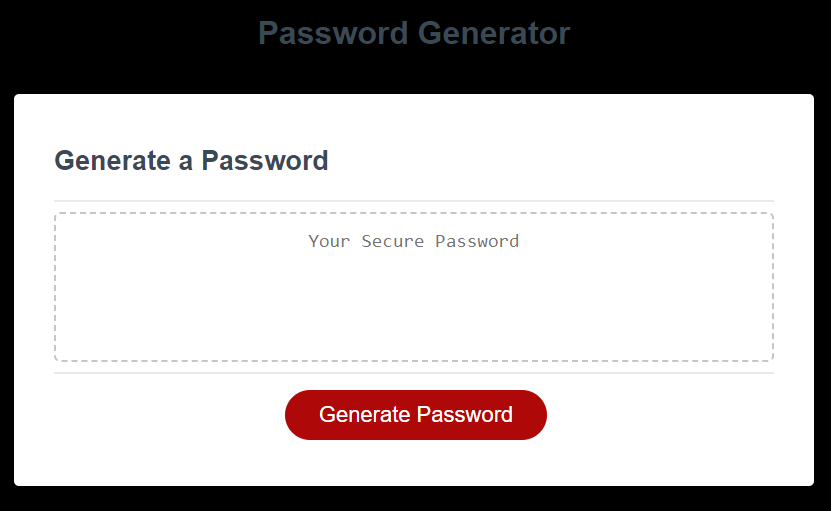
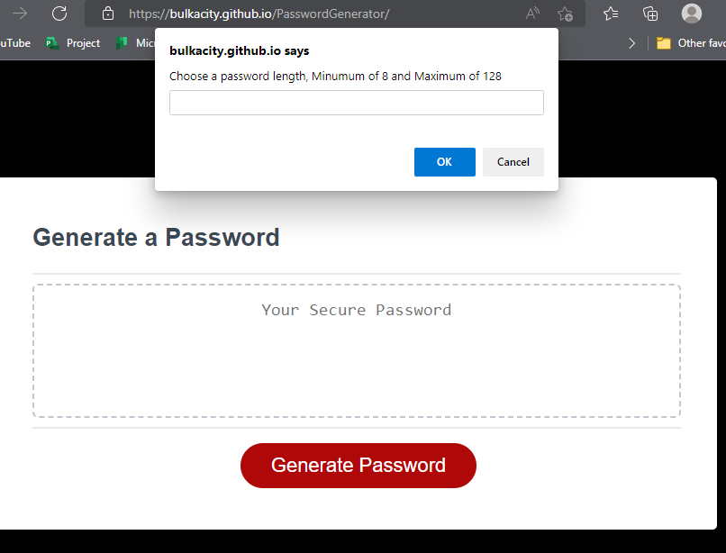

# JavaScript: Password Generator

## How to use

This website will generate a password upon clicking generate password button and answering the prompts.

Questions asked will be :

1. Choose a password length, Minumum of 8 and Maximum of 128.
2. Ok, Yes I want at least 1 number. Cancel, no I do not want numbers.
3. Ok, I want at least 1 special characters, Cancel , I do not want special characters.
4. Ok, I want upper case. Cancel , I do not want upper case.
5. Ok, i want lower case. Cancel, I do not want lower case.

## Screen Clips

The following image shows the web application's appearance and functionality:

## File Structure

##### root

`Develop/`

- Contains HTML, Script.js , style;

`assets/`

- Contains CSS, Images;

## Link to Website

Click here 
*Home Page* [Password Generator Website](https://bulkacity.github.io/PasswordGenerator/)